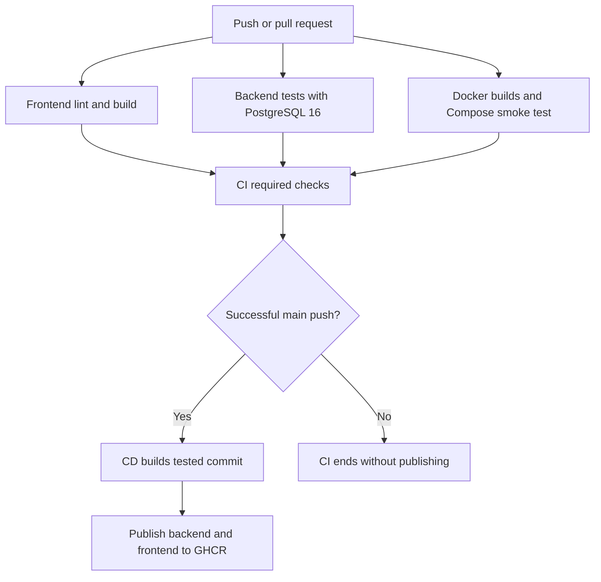

# SecureByte multi-factor authentication system

SecureByte is an academic MFA application with an Express API, PostgreSQL, and a React/Vite frontend. The backend uses Argon2id passwords, AES-256-GCM encrypted TOTP secrets, and database-backed opaque session cookies.

The existing authentication design is preserved: registration grants only enrollment scope, password verification grants only pending MFA scope, and TOTP verification creates a full session. See [backend setup and API documentation](backend/README.md) and the historical [authentication integration evidence](backend/docs/auth-flow-integration-test-evidence.md).

## CI/CD & DevOps

### Repository architecture

| Path | Responsibility |
| --- | --- |
| `backend/src/server.js` / `app.js` | Real server entrypoint, routes, health endpoints and error handling |
| `backend/src/controllers`, `services`, `middleware` | Registration, password/TOTP/recovery operations and session authorization |
| `backend/src/database/schema.sql` | PostgreSQL schema and indexes, applied in CI and on first Compose startup |
| `backend/src/data/common-passwords.txt` | Runtime password blocklist; included in the backend image |
| `frontend/src` | React frontend; requests relative `/api` URLs |
| `frontend/nginx.conf` | Serves compiled Vite assets and proxies `/api` to the backend on the same origin |

### CI triggers and stages

[`.github/workflows/ci.yml`](.github/workflows/ci.yml) runs on pull requests targeting `main`, pushes to `main`, `develop`, `feature/**` and `devops/**`, and manual dispatch. There are no path filters, so the required check always reports. A newer run cancels an older run for the same branch or pull request. A feature push with an open PR can produce both a push and a PR run; the latter tests GitHub's merge ref.

Three jobs run independently, followed by a required-check gate:

1. **Frontend lint and production build:** Node.js 20, one `npm ci`, the existing `npm run lint` (Oxlint), then `npm run build` (Vite).
2. **Backend and PostgreSQL integration tests:** Node.js 20, one `npm ci`, syntax/import checks, automatic schema application, and real HTTP/database tests. A PostgreSQL 16 service creates the isolated `securebyte_test` database and is checked with `pg_isready` before steps start. The job uses `127.0.0.1:5432` because commands run on the host runner, not inside a job container. Test database credentials are disposable public fixtures; a new non-production TOTP key is generated for each job.
3. **Docker builds and Compose smoke test:** Buildx builds both production images with `push: false` and loads them into the runner. Compose starts those exact local images, waits for health checks, then checks the frontend and both proxied API health endpoints. Cleanup removes only that runner's disposable containers and volume.
4. **CI required checks:** succeeds only when all three jobs succeed. Failure, cancellation or skipping of a dependency cannot make the gate pass.

Dependency downloads are cached separately using each directory's lockfile. `node_modules` is not shared between jobs or platforms. Docker uses its own layer caches; building in Docker still requires an image-specific dependency install. No CI job logs into a registry or has package-write permission.



### Automated tests

`backend/test/auth.integration.test.js` uses Node's built-in test runner and HTTP client with the actual `src/server.js` process. There is no mocked database, password verifier, TOTP verifier or session middleware. The suite has nine test cases with multiple assertions per case.

| Automated coverage | Historical evidence |
| --- | --- |
| Backend health and a real database health query | API health endpoints |
| Anonymous, malformed and forged cookies rejected | GUARD1 |
| Registration validation and controlled malformed-JSON errors | Password policy / malformed-request evidence |
| Normalized usernames, duplicate rejection, Argon2id hashes and fresh salts | REG1, PWD3 |
| Wrong-password, unknown-user and disabled-account generic failures | PWD2 / first-factor failure evidence |
| Interrupted enrollment resumes with password; dashboard remains denied | ENR2 |
| Five password failures restrict subsequent correct-password requests | PWD4 |
| Registration → real enrollment → password-only denial → TOTP → dashboard/session | REG2, ENR1, AUTH1, AUTH2 |
| Pending scopes cannot become full sessions; token hashes and cookie flags | TOKEN1, COOKIE1 |
| Encrypted TOTP storage, replay rejection, expiry, disabled-account guard, logout revocation, JSON content-type checks | TOTP2, GUARD1, LOGOUT1 / CSRF |

Enrollment consumes a real TOTP step. The full-flow test waits up to about 30 seconds for the next real step; it never resets replay state to make login pass. Expiry and account-status guard checks use explicit database fixture changes. Tests reset their database tables between cases, run serially, and stop their child server afterward.

Both schema preparation and tests refuse to run unless `NODE_ENV=test`, the database name ends in `_test`, and the database/key/cookie settings are explicit. **Use a dedicated disposable database: test tables are truncated.** Missing configuration or database access fails the suite; tests are not silently skipped.

The HTTP client sends cookies explicitly over loopback HTTP and asserts `HttpOnly`, `Secure`, `SameSite=Lax`, and `Path=/`. It does not emulate a browser's HTTPS/SameSite enforcement. This is a backend integration suite, not a browser E2E or complete security audit. Recovery, concurrency races, all second-factor lockout scenarios, and the entire historical manual suite are not covered.

### Docker architecture

| Service | Image design | Readiness / exposure |
| --- | --- | --- |
| `db` | PostgreSQL 16 Alpine, persistent named volume, real schema mounted read-only for initial creation | `pg_isready`; no published database port |
| `backend` | Node.js 20 Debian slim, production dependencies installed with `npm ci --omit=dev` in a separate stage; native build tools stay out of runtime | Non-root `node`, `/api/health/db` check; internal port 5000 |
| `frontend` | Node.js 20 build stage, only Vite `dist` copied into nginx Alpine runtime | Non-root `nginx`, `/healthz` check; `127.0.0.1:8080` by default |

Compose waits for database health before starting the backend and backend health before starting nginx. The backend and frontend have read-only filesystems, writable temporary directories, dropped Linux capabilities, and no-new-privileges. nginx preserves API paths and cookies, disables API caching, and resolves the backend through Docker DNS after container replacement. The frontend image contains no Node development server.

`.dockerignore` files allow only build inputs and explicitly exclude environment files and private key files. Dockerfiles never accept database passwords or TOTP keys as build arguments. Root `.gitignore` ignores populated environment variants and allows example files. The original backend environment example's embedded password has been removed; any real credential once committed must be rotated outside Git.

### Run with Docker Compose

Requirements: Docker Engine/Desktop with the Compose v2 plugin supporting `up --wait`.

```bash
cp .env.example .env
openssl rand -hex 24   # put a generated password into DATABASE_PASSWORD in .env
openssl rand -hex 32   # put a separate generated key into TOTP_ENCRYPTION_KEY in .env
# Edit .env locally. Never commit it or paste its contents into CI logs.
docker compose config --quiet
docker compose up --build --wait --wait-timeout 180
curl --fail http://localhost:8080/api/health
curl --fail http://localhost:8080/api/health/db
docker compose ps
```

Open [http://localhost:8080](http://localhost:8080). The example explicitly sets `COOKIE_SECURE=false` for this loopback-only HTTP setup. Compose defaults to secure cookies if that value is absent. Use `COOKIE_SECURE=true` and HTTPS for a hosted environment; no TLS hosting platform has been configured here.

```bash
docker compose logs --tail=100 backend frontend db
docker compose down                   # preserves the database volume
docker compose build backend frontend
# Equivalent independent builds:
docker build -t securebyte-backend:local ./backend
docker build -t securebyte-frontend:local ./frontend
```

The PostgreSQL initialization script runs only on an empty volume. After a schema change, back up any valuable data and apply the existing idempotent schema explicitly:

```bash
docker compose exec -T db sh -c 'psql -v ON_ERROR_STOP=1 -U "$POSTGRES_USER" -d "$POSTGRES_DB"' < backend/src/database/schema.sql
```

Changing the password in `.env` does not change an existing PostgreSQL role's password. Update the role through PostgreSQL administration, or deliberately recreate a disposable local database. `docker compose down --volumes` **deletes local database data** and is not a normal stop command. Keep the TOTP encryption key with its database; generating a replacement key makes existing encrypted secrets unreadable.

### Continuous delivery to GHCR

[`.github/workflows/cd.yml`](.github/workflows/cd.yml) responds to the completion of **CI** on `main`. Publishing requires all of: CI success, originating event `push`, branch `main`, and the same source repository. Pull requests, failed CI runs, and manually dispatched CI runs do not publish.

1. Check out `workflow_run.head_sha`, the exact commit that passed CI; do not use the newer default-branch SHA carried by `workflow_run`.
2. Lowercase the repository image name and check whether that tested SHA is still the current `main` head.
3. Set up Buildx and authenticate to `ghcr.io` with GitHub's automatically supplied `GITHUB_TOKEN`.
4. Use Docker's metadata action to create tags and source/revision labels.
5. Build and publish separate `linux/amd64` backend and frontend images through Docker's build/push action. Only these publication jobs have `packages: write`; checkout keeps credentials out of Git configuration.

Published image names in this repository:

```text
ghcr.io/birajithk/multi-factor-authentication-system-backend:sha-<full-commit-sha>
ghcr.io/birajithk/multi-factor-authentication-system-frontend:sha-<full-commit-sha>
ghcr.io/birajithk/multi-factor-authentication-system-backend:latest
ghcr.io/birajithk/multi-factor-authentication-system-frontend:latest
```

Every delivery has a full commit SHA tag. `latest` is added only when the tested commit is still the current main head at the eligibility check. Deliveries are serialized and an old CI rerun cannot overwrite `latest` once main has moved on. Use matching SHA tags for both components; publication of the two packages is not atomic. GHCR tags can be overwritten on a rerun, so use the image digest when byte-for-byte identity matters.

CD rebuilds the tested source using its lockfiles; it does not promote the exact CI image bytes. Base image tags can move, so these are source-versioned builds, not fully hermetic builds. GitHub Actions are pinned to full commit SHAs; review and update their pins and base images periodically. CI and CD use separate Docker cache scopes, and CD never downloads PR artifacts.

This is **continuous delivery**, ending with published images. It does not claim production deployment. No cloud account, SSH host, cluster, domain, TLS certificate, deployment credential, migration approval, monitoring, or production database has been invented.

### GitHub settings

1. Enable GitHub Actions and allow the official `actions/*` and `docker/*` actions used here, plus their pinned revisions. Allow GitHub-hosted Ubuntu runners and package publication under applicable repository/organization policies.
2. Keep default workflow token permissions read-only; the CD job explicitly requests `contents: read` and `packages: write`. No personal access token, Docker Hub secret, database secret, or production TOTP key is needed by these workflows.
3. After CI has run once, protect `main` with required pull requests and the **CI required checks** status check. Optionally require an up-to-date branch before merging. Protect workflow changes with review.
4. Merge both workflows into the default branch (`main`) to enable `workflow_run` delivery. A branch-only workflow file cannot trigger CD. The first successful push-to-main CI run after the merge can publish.
5. Under each GHCR package's settings, verify that this repository has Actions write access, especially if a package with the same name already exists. Choose public/private visibility deliberately. Private image pulls outside Actions require separate read-package authentication; publication uses only the built-in token.
6. Fork pull requests may require maintainer approval to run, depending on repository policy. They still receive no publish job or production credentials.

### Reproduce CI locally

Use Node.js 20.19+ (the current frontend lockfile requires at least 20.19). With nvm:

```bash
nvm install
nvm use
(cd frontend && npm ci && npm run lint && npm run build)
(cd backend && npm ci && npm run check)
```

For integration tests, use a **fresh dedicated** PostgreSQL 16 database. These Bash commands start an isolated example on port 55432, without using your normal `.env`:

```bash
export NODE_ENV=test
export DATABASE_HOST=127.0.0.1
export DATABASE_PORT=55432
export DATABASE_NAME=securebyte_test
export DATABASE_USER=securebyte_ci
export DATABASE_PASSWORD="$(openssl rand -hex 24)"
export TOTP_ENCRYPTION_KEY="$(openssl rand -hex 32)"
export COOKIE_SECURE=true
export AUTH_SOURCE_LIMIT=20
export AUTH_SOURCE_WINDOW_SECONDS=60

docker run --detach --rm --name securebyte-ci-postgres \
  --publish 127.0.0.1:55432:5432 \
  --env POSTGRES_DB="$DATABASE_NAME" \
  --env POSTGRES_USER="$DATABASE_USER" \
  --env POSTGRES_PASSWORD="$DATABASE_PASSWORD" \
  --health-cmd='pg_isready -U "$POSTGRES_USER" -d "$POSTGRES_DB"' \
  --health-interval=2s --health-timeout=5s --health-retries=30 \
  postgres:16-alpine

# Wait for healthy before continuing (inspect returns "healthy").
docker inspect --format '{{.State.Health.Status}}' securebyte-ci-postgres
(cd backend && npm run db:test:prepare && npm test)
docker stop securebyte-ci-postgres
unset NODE_ENV DATABASE_HOST DATABASE_PORT DATABASE_NAME DATABASE_USER DATABASE_PASSWORD
unset TOTP_ENCRYPTION_KEY COOKIE_SECURE AUTH_SOURCE_LIMIT AUTH_SOURCE_WINDOW_SECONDS
```

The health-inspection command reports status; it does not wait automatically. If it reports `starting`, run it again before running tests. Use a fresh shell for the Compose instructions so exported test settings do not override `.env` values. Docker build/Compose validation commands are in the preceding section. `actionlint` from its official project can additionally validate both workflow files locally.

### Existing application limits and production prerequisites

Repository inspection identified existing unfinished integration, which this infrastructure change does not rewrite: the frontend has a demonstration setup key and incomplete enrollment/recovery screens, some frontend response handling expects `code` rather than the API's `result`/nested `error`, recovery handlers and guards use different identity properties, and TOTP/logout logger integration remains a placeholder. Passing CI therefore establishes the automated backend subset and container startup, not a complete user-facing MFA product.

Express currently does not trust forwarded client addresses. Through nginx, the existing source-rate limiter sees the proxy address, so clients share that source budget. Before external hosting, explicitly define trusted proxy boundaries and test forwarded-address handling; blindly enabling `trust proxy` would weaken the current security assumptions. TLS termination, restricted production database roles, backups, monitoring, secret management, and migration procedures also remain deployment responsibilities. Compose's bootstrap database role is for local use, not a production least-privilege role design.

Node.js 20 is retained to meet the requested pipeline/runtime target. It is now [end of life](https://nodejs.org/en/about/eol); move to a supported LTS release in a separate, tested upgrade before production hosting. Actions' own JavaScript runtimes are independent of the application's Node.js version.

See [debugging and interview questions](docs/devops-interview.md) and [implementation verification](docs/ci-cd-validation.md).
